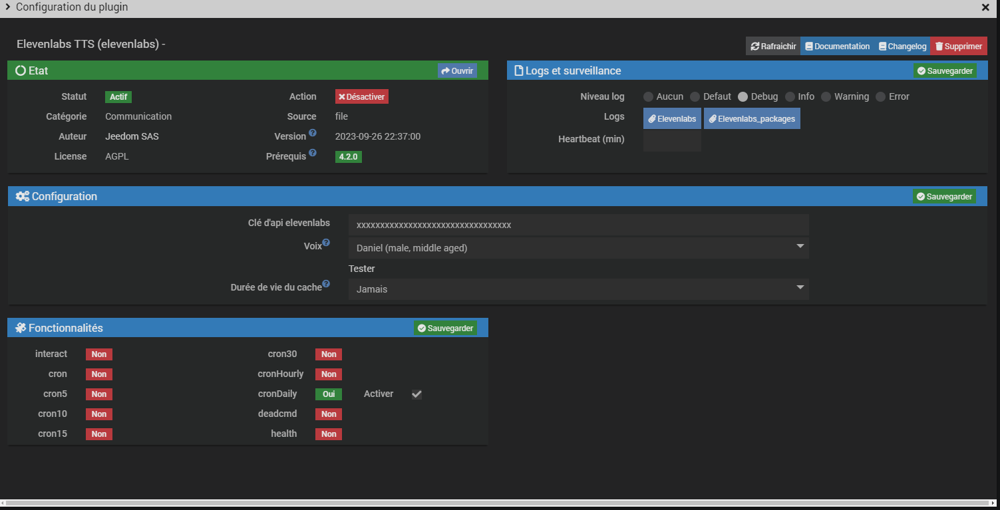
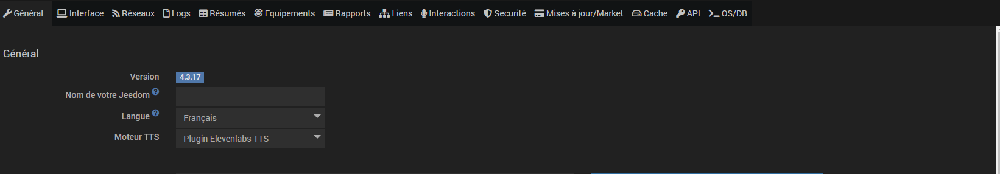

# Elevenlabs TTS Plugin

Plugin allowing to natively integrate **Elevenlabs** voices for TTS in **Jeedom**.

# Configuration 

### Elevenlabs API key
You must enter your Elevenlabs API key. Here is the documentation to find your key. [Elevenlabs documentation](https://docs.elevenlabs.io/api-reference/quick-start/authentication).

**Once your key is entered, please save the configuration before continuing.**

### Voice and test
You can choose the voice you want to use from the dropdown menu. And you can listen to it by clicking on the test button.

### Cache lifetime
Duration during which unused TTS mp3 files will be kept.

## TTS engine choice

To select the Elevelabs TTS engine, go to the following menu: *Settings > System > Configuration*

Then in *TTS engine* select **Elevenlabs TTS Plugin**

