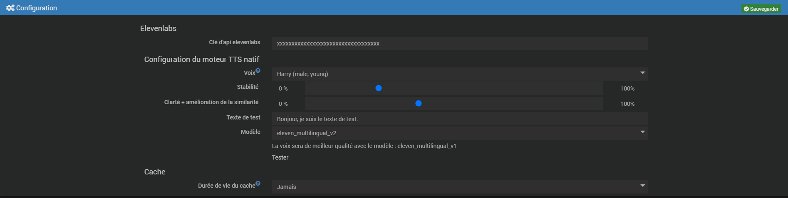

# Elevenlabs TTS Plugin

Plugin allowing to natively integrate **Elevenlabs** voices for TTS in **Jeedom**.

# Configuration 

### Elevenlabs API key
You must enter your Elevenlabs API key. Here is the documentation to find your key. [Elevenlabs documentation](https://docs.elevenlabs.io/api-reference/quick-start/authentication).

**Once your key is entered, please save the configuration before continuing.**

### Voice and test
#### Voice configuration
You can choose a voice, and adjust its stability and clarity.
You can select which elevenlabs model you'd like to use.
The V2 model is more efficient, but some voices sound better with the V1 model. In this case, a small message will alert you to the fact that the V1 model is more suitable.

And you can enter a test text to listen to the voice with the "test" button.

### Cache lifetime
Duration during which unused TTS mp3 files will be kept.

## TTS engine choice

To select the Elevelabs TTS engine, go to the following menu: *Settings > System > Configuration*

Then in *TTS engine* select **Elevenlabs TTS Plugin**

## TTS equipment
### Equipment creation

When creating a rig, you can choose a voice, and adjust its stability and clarity.
You can select which elevenlabs model you'd like to use.
The V2 model is more efficient, but some voices sound better with the V1 model. In this case, a small message will alert you to the fact that the V1 model is more suitable.

And you can enter a test text to listen to the voice with the "test" button.

### Using the equipment

The equipment has two commands.
An action command (TTS) of message type, which will generate the MP3 file according to the voice configuration for this device.
An info command (MP3 file) whose value is the file path of the last MP3 file generated.
You can access the MP3 file by concatenating your jeedom address and the result of the info command.

example: https://myjeedom.com/#command_result_(MP3 File)#

The devices cannot be used on their own, but are intended to be used, for example, in a scenario to generate the file and give it to a device to talk to via another plugin.