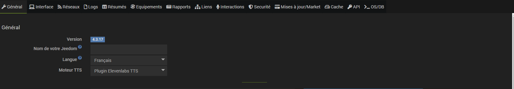
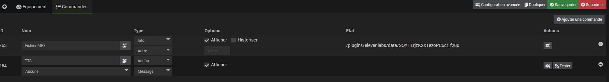

# Plugin Elevenlabs TTS

Plugin permettant d'intégrer nativement dans **Jeedom** les voix de **Elevenlabs** pour le TTS.

# Configuration 

### Clé d'api elevenlabs
Vous devez rentrer votre clé d'api elevenlabs. Voici la documentation pour trouver votre clé. [Documentation elevenlabs](https://docs.elevenlabs.io/api-reference/quick-start/authentication).

**Une fois votre clé saisie, veuillez sauvegarder la configuration avant de continuer.**

### Configuration du moteur TTS natif
#### Configuration de la voix
Vous pouvez choisir une voix, et adapter sa stabilité et sa clarté.
Vous pouvez sélectionner quel modèle d'elevenlabs vous souhaitez utiliser.
Le modèle V2 est plus efficace mais certaines voix ont un meilleur rendu avec le modèle V1. Dans ce cas un petit message vous alertera pour vous prévenir que le modèle V1 est plus adapté.

Et vous pouvez saisir un texte de test pour écouter la voix avec le bouton "tester".

### Durée de vie du cache
Durée durant laquelle les fichiers mp3 TTS non utilisés seront conservés.

## Choix moteur TTS

Pour sélectionner le moteur TTS Elevelabs, allez dans le menu suivant : *Réglages > Système > Configuration*

Puis dans *Moteur TTS* selectionner **Plugin Elevenlabs TTS**

## Équipement TTS
### Création d'un équipement

Dans la création d'un équipement vous pouvez choisir une voix, et adapter sa stabilité et sa clarté.
Vous pouvez sélectionner quel modèle d'elevenlabs vous souhaitez utiliser.
Le modèle V2 est plus efficace mais certaines voix ont un meilleur rendu avec le modèle V1. Dans ce cas un petit message vous alertera pour vous prévenir que le modèle V1 est plus adapté.

Et vous pouvez saisir un texte de test pour écouter la voix avec le bouton "tester".

### Utilisation de l'équipement

L'équipement à deux commandes.
Une commande action (TTS) de type message qui va générer le fichier MP3 selon la configuration de la voix pour cet équipement.
Une commande info (Fichier MP3) qui aura pour valeur le chemin du fichier du dernier fichier MP3 généré.
Vous pouvez avoir accès au fichier MP3 en concaténant votre adresse du jeedom et le résultat de la commande info.

exemple : https://monjeedom.com/#résultat_de_commande_(Fichier_MP3)#

Les équipements ne peuvent pas être utilisés seuls, ils sont prévus pour être utilisés par exemple dans un scénario pour générer le fichier et donner pour faire parler un équipement via un autre plugin.